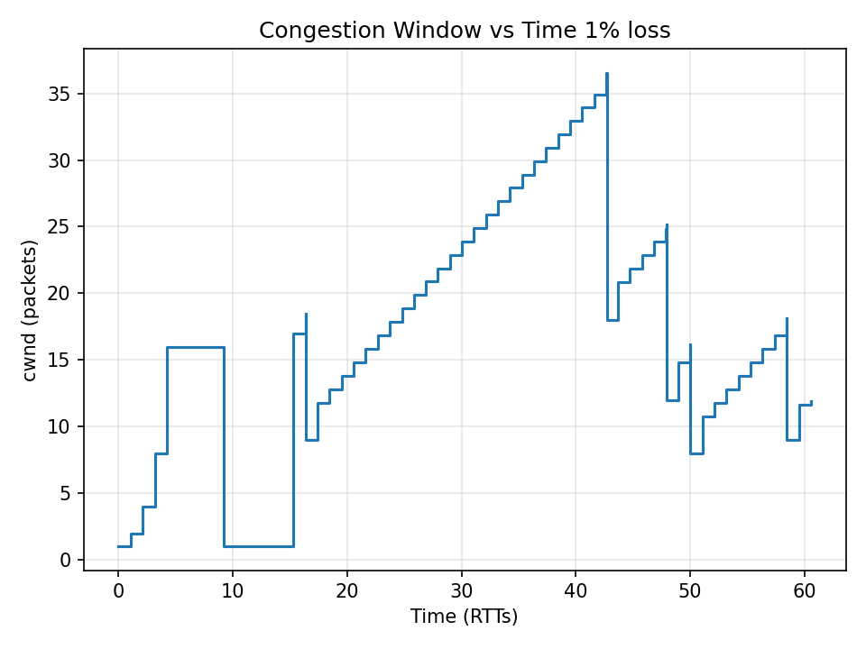
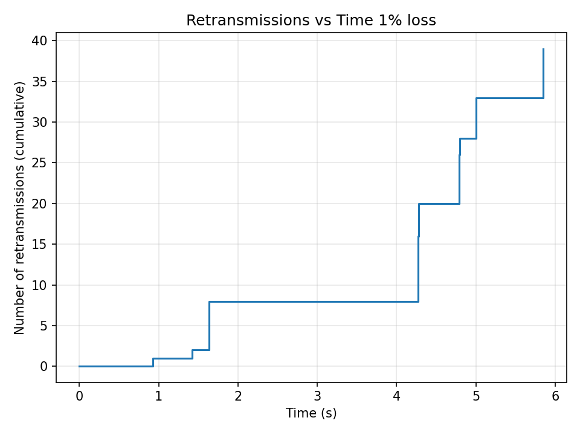
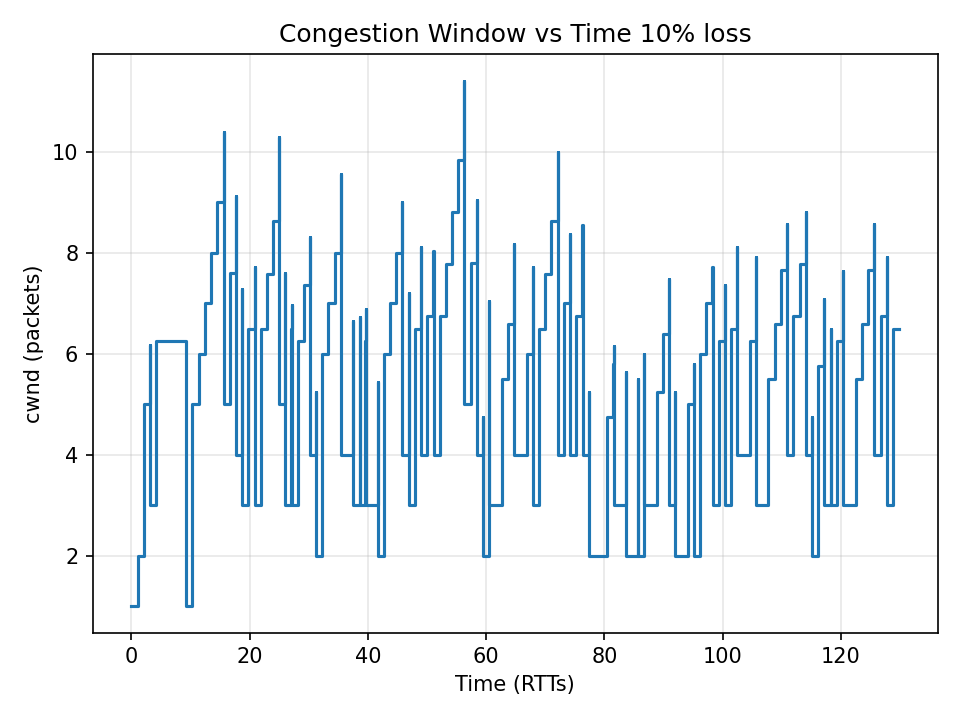
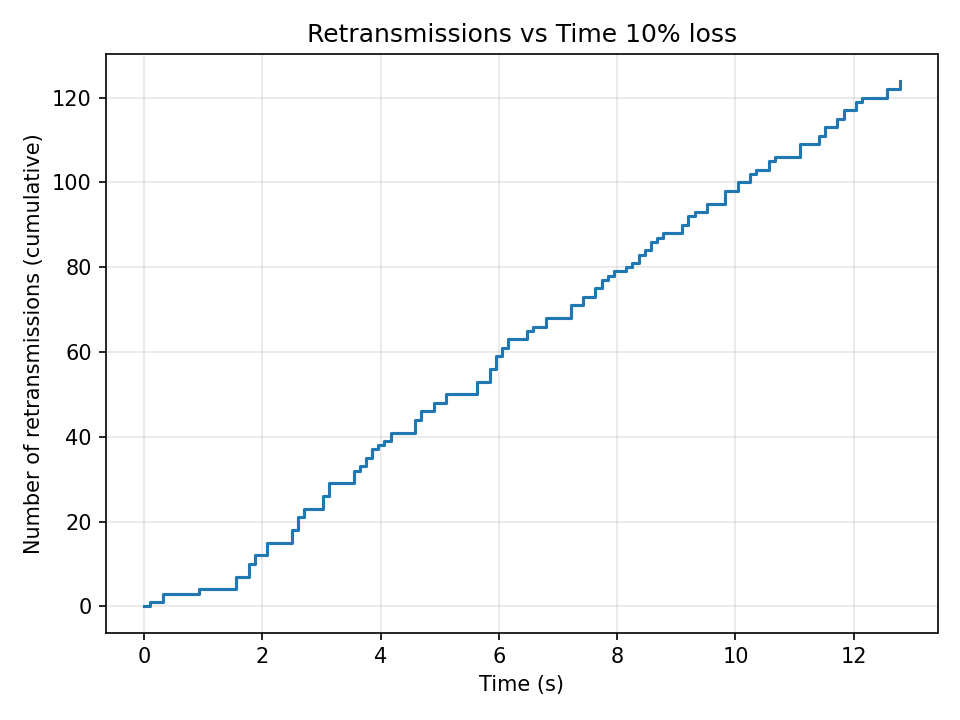
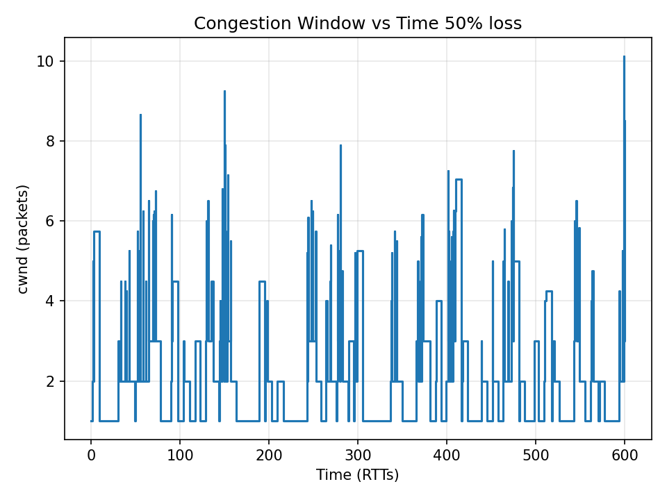
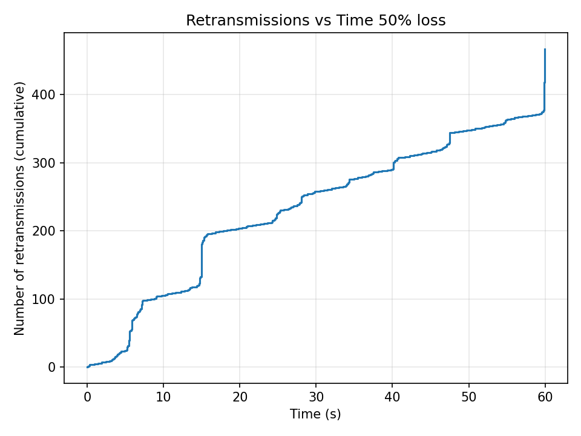

# Reliable Transport and P2P File Sharing

Two networking projects written in Python on raw sockets, using only the standard library and no networking frameworks.

| Project | What it is |
|---------|------------|
| [`tcp-reno-over-udp/`](tcp-reno-over-udp/) | TCP Reno congestion control implemented on top of UDP: sequence numbers, checksums, cumulative ACKs, slow start, congestion avoidance, fast retransmit, fast recovery, and timeouts |
| [`p2p-file-sharing/`](p2p-file-sharing/) | A peer-to-peer file sharing network with a central tracker, a custom binary wire protocol, retransmission, and MD5 integrity checks |

Requires Python 3. There are no dependencies to install.

---

## TCP Reno over UDP

UDP delivers packets with no guarantees: they can be lost, duplicated, or reordered. This project builds reliable, congestion-controlled file transfer on top of it by implementing the TCP Reno algorithm from scratch.

### Packet format

```
Data packet:  | seq (4 bytes) | checksum (2 bytes) | data (up to 1024 bytes) |
ACK packet:   | ack (4 bytes) |
```

- `seq` is the byte offset of the chunk in the file, as in real TCP.
- `ack` is cumulative: the next byte offset the receiver expects.
- `checksum` is `sum(data) % 65535`. Packets that fail the check are dropped.

### Sender (`tcp_client.py`)

- **Slow start:** `cwnd` starts at 1 and grows by 1 for every new ACK, so it roughly doubles each round trip until it reaches `ssthresh`.
- **Congestion avoidance:** above `ssthresh`, `cwnd` grows by `1/cwnd` per ACK, which is about one packet per round trip.
- **Fast retransmit:** after 3 duplicate ACKs, the sender halves `cwnd` and immediately resends the missing packet.
- **Fast recovery:** the sender records a recovery point so that duplicate ACKs from the same loss event halve `cwnd` only once. It inflates `cwnd` while in recovery, resends on partial ACKs, and resends again if the retransmission itself is lost.
- **Timeout:** if no ACK arrives within 500 ms, the sender sets `ssthresh` to half of `cwnd`, resets `cwnd` to 1, and resends from the last acknowledged byte.

### Receiver (`tcp_server.py`)

- Buffers out-of-order packets and writes them to disk once the gap is filled.
- Sends an immediate duplicate ACK when a packet arrives out of order, which drives fast retransmit on the sender.
- Uses a 100 ms delayed-ACK timer for in-order data.
- Drops incoming packets at a configurable probability to simulate a lossy network.
- Includes a forced timeout test (see below).

### Why the receiver withholds ACKs on purpose

At low loss rates, fast retransmit recovers from almost every drop, so the 500 ms timeout path would rarely run. I added a forced timeout so that this path is always exercised. When the loss rate is 10% or lower, the receiver stops sending ACKs for 0.55 s once 22,528 bytes (22 full 1024-byte chunks) have arrived. That pause is just longer than the sender's 500 ms timeout, so the sender is guaranteed to time out once, reset `cwnd` to 1, and recover through slow start. This test causes the single sharp dip in the 1% loss graph below.

### Results

Transfer behavior measured at three simulated packet loss rates:

| Loss rate | Congestion window | Retransmissions | Transfer time |
|-----------|-------------------|-----------------|---------------|
| 1% | Climbs to about 35 packets, with one dip from the forced timeout test | About 39 | About 6 s |
| 10% | Classic Reno sawtooth between 2 and 10, averaging about 4 to 6 | About 123 | About 13 s |
| 50% | Stuck near 1, with brief spikes to 5 to 10 | About 470 | About 60 s |

Higher loss means a smaller average window, a steeper retransmission rate, and a longer transfer.

| Congestion window over time | Retransmissions over time |
|-----------------------------|---------------------------|
|  |  |
|  |  |
|  |  |

The full write-up is in [`tcp-reno-over-udp/REPORT.md`](tcp-reno-over-udp/REPORT.md).

### What was hard

The textbook summary of slow start, congestion avoidance, and fast retransmit is not enough on its own. A naive version halved `cwnd` on every set of 3 duplicate ACKs, which drove it to 1 within a few losses. At a window of 2, a single lost packet could not produce enough duplicate ACKs to trigger fast retransmit at all, so the transfer stalled. Fixing this took the full recovery logic: halve once per loss event, inflate the window during recovery, resend on partial ACKs, and send an extra packet on early duplicate ACKs.

### Running it

```bash
cd tcp-reno-over-udp

# Terminal 1: start the receiver with a packet loss probability (0.1 = 10%)
python3 tcp_server.py 0.1

# Terminal 2: send a file, labeling the output with the loss rate
python3 tcp_client.py <path-to-file> 10
```

The receiver listens on `localhost:2026` and writes the reassembled file to `received.txt`. The sender writes its congestion window and retransmission history to `cwnd_<label>.csv` and `retransmit_<label>.csv`, so the command above produces `cwnd_10.csv` and `retransmit_10.csv`. The label is optional and defaults to `run`.

---

## P2P File Sharing

Each peer is both a server, which shares the files in its directory, and a client, which downloads files from other peers. Peers find each other through a central tracker, but file data always flows directly between peers. Anything a peer downloads is re-shared with the rest of the network.

- **Custom binary protocol** over TCP, with length-framed messages for offers, queries, transfers, ACKs, and errors
- **Tracker registry** that maps files to peers, with peers re-advertising every 10 seconds and the tracker removing any peer silent for 30 seconds
- **Reliable chunk transfer** with 1024-byte chunks, per-chunk checksums, cumulative ACKs, a 0.5 s timeout, and up to 30 retries
- **Whole-file MD5 check** after every download
- **Loss simulation** to exercise the retransmission path, verified with 35% simulated loss

### Running it

```bash
cd p2p-file-sharing

python3 tracker.py localhost 5050                                # Terminal 1
python3 peer.py localhost 5101 localhost 5050 peerA_files         # Terminal 2
python3 peer.py localhost 5102 localhost 5050 peerB_files 0.35    # Terminal 3, with 35% loss
```

Then type `get report.txt` at peer B's prompt. The full protocol specification, message types, and test results are in [`p2p-file-sharing/README.md`](p2p-file-sharing/README.md).

---

## Repository layout

```
tcp-reno-over-udp/
  tcp_client.py     Sender with TCP Reno congestion control
  tcp_server.py     Receiver with reordering buffer and loss simulation
  graphs/           Congestion window and retransmission plots at 1%, 10%, and 50% loss
  REPORT.md         Design and results write-up
p2p-file-sharing/
  peer.py           Peer node (file server and download client)
  tracker.py        Central registry of which peers offer which files
  peerA_files/      Sample shared files
  peerB_files/
  README.md         Protocol specification and testing notes
```

## Author

Shrey Shah, California Polytechnic State University, San Luis Obispo. Built as coursework for CSC 364 (Introduction to Networked, Distributed, and Parallel Computing).
